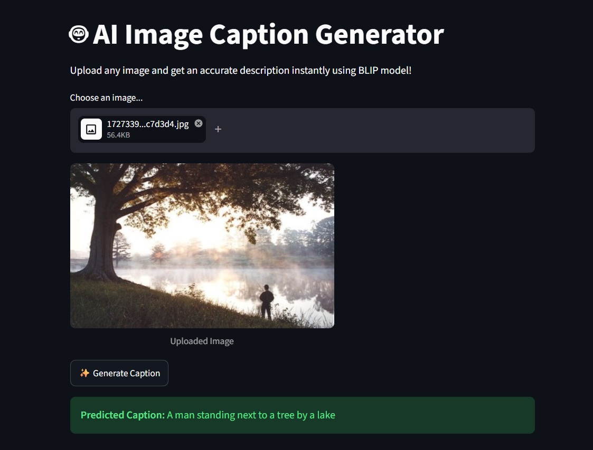

# 📸 Image Captioning Architecture (CNN-LSTM)

An end-to-end Deep Learning pipeline built from scratch using **PyTorch** to generate coherent, sequential textual descriptions for input images. The project utilizes a hybrid architecture combining a Convolutional Neural Network (CNN) for visual feature extraction and a Recurrent Neural Network (RNN-LSTM) for text generation.

---

## 🔗 Live Deployments & UI Links
✨ **Click on the badges below to interact with the project and view the user interface:**

[](https://image-captioning-project-9rkwwvmrgxtg3zhqttpu2f.streamlit.app/)

---

## 🚀 Key Features
* **Custom Data Pipeline:** Engineered robust text-preprocessing with special tokens (`SOS`, `EOS`, `PAD`), dynamic tokenization, and vocabulary mapping.
* **Hybrid Model Architecture:** Pre-trained/Custom CNN Encoder (visual processing) coupled with a multi-layer LSTM Decoder (sequence-to-sequence language modeling).
* **Advanced Inference Logic:** Integrated both Greedy Search and **Beam Search Decoding** techniques to prevent token repetition loops and optimize sentence structures.
* **Modular Codebase:** Production-ready project structure separated into data processing (`utils.py`), neural modeling (`model.py`), training loops, and local deployment modules.

---

## 📊 System Architecture

The pipeline processes input images through a spatial feature extractor, maps text through an embedding layer, and feeds the merged vector space into sequential memory cells:

1. **Vision Encoder:** CNN blocks extract deep feature vectors from raw input images ($224 \times 224 \times 3$) and map them to the embedding space.
2. **Language Decoder:** Embedding layers process input tokens, feeding hidden state sequences into a custom LSTM cell.
3. **Beam Search Inference:** Tracks the top $K$ highest-probability sequence paths iteratively rather than picking just one greedy token, ensuring robust captions.

---

## 🛠️ Tech Stack & Libraries
* **Core Framework:** PyTorch, Torchvision
* **Deployment & APIs:** FastAPI, Uvicorn, Streamlit
* **Data Engineering:** Pandas, NumPy, Pillow (PIL)
* **Visualizations:** Matplotlib, Seaborn
* **Environment:** Python, Jupyter Notebook / VS Code

---

## 📂 Project Structure
```text
├── data/
│   └── raw/               # Flickr8k Images and Captions text
├── src/
│   ├── model.py           # ImageEncoder and CaptionDecoder classes
│   └── utils.py           # Custom vocabulary builders, transformations, and Beam Search functions
├── artifacts/             # Trained model checkpoints (.pth weights)
├── app.py                 # FastAPI backend & Streamlit frontend integration
├── experimentation.ipynb  # Interactive training, validation, and inference loops
└── README.md              # Project documentation


```
## 📈 Training Performance & Evolution
The model was trained locally using custom batch-sizing logic to optimize CPU-bound matrix multiplications.
 * **Dataset Size:** ~8,000 images with 5 captions per image (Flickr8k dataset standard)
 * **Convergence Progress:** Final Training Loss dropped significantly to 2.4481 at Epoch 5.
### 🔄 Model Progress Visualization (Epoch 1 vs Epoch 5)
| 🔹 Training Commencement (Epoch 1) | 🔹 Final Model Convergence (Epoch 5) |
|---|---|
|  |  |
| *Initial state: Higher loss with basic token generation attempts.* | *Optimized state: Final Loss dropped to 2.4481 with structured captions.* |




   
